<!-- # System Architecture Overview -->

---

# Architecture Benefits

## 🔒 **Security & Authentication**
- Centralized authentication via Nginx reverse proxy
- Unified access control across micro-frontends
- Secure DICOM data handling

## ⚡ **Performance & Scalability**
- Declarative caching with TanStack Query
- Automated cache invalidation
- Asynchronous workflow orchestration

## 🔧 **Integration & Flexibility**
- Multi-layered abstraction with PostgreSQL views
- Database-centric automation engine
- Open-source platform integration