# Annotation Workflow Process

---
layout: two-cols
---

# Workflow Features

::left::

## 📋 **Multi-Stage Process**
- **Stage 1**: Initial annotation assignment
- **Stage 2**: AI-assisted annotation
- **Stage N**: Expert review & validation
- **Success**: Final approval & archival

## 🤝 **Collaboration Tools**
- Real-time communication
- Expert validation workflows
- Instant feedback mechanisms
- Quality control processes

::right::

## ⚙️ **Automation Engine**
- Cron-based task scheduling
- Database-centric state management
- Automated workflow transitions
- Non-interactive process orchestration

## 🎯 **Task Management**
- Skill-based assignment
- Clear role definitions
- Progress tracking
- Quality gates at each stage