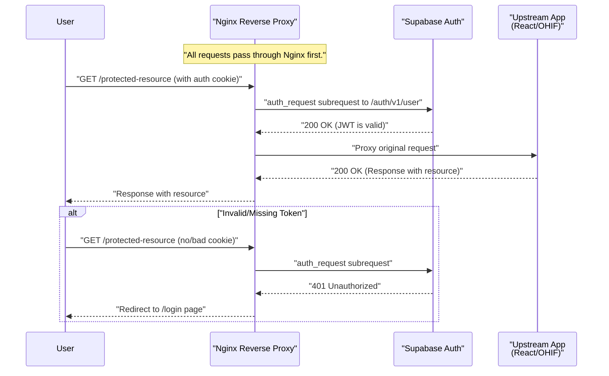

# Nginx Authentication Sequence

---
layout: two-cols
---

# Security Implementation

::left::

## 🔐 **Centralized Authentication**
- Single source of truth for auth state
- Nginx reverse proxy handles all requests
- Supabase JWT validation
- Automatic session management

## 🛡️ **Protection Mechanisms**
- All routes protected by default
- Cookie-based authentication
- Automatic token validation
- Secure redirection on failure

::right::

## 🌐 **Micro-Frontend Integration**
- Unified auth across React app & OHIF
- Seamless user experience
- No auth state duplication
- Cross-component session sharing

## ⚡ **Performance Benefits**
- Auth validation at proxy level
- Reduced backend auth load
- Cached authentication decisions
- Efficient request routing